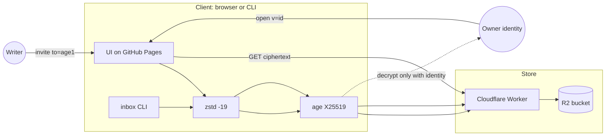

# Architecture — age inbox Phase 1

Audience: implementing agents. If this file and the code disagree, fix the code or update this file in the same change.

## 1. Picture



Trust boundary: left of the Worker is allowed to see plaintext (the user's machine). The Worker and R2 see only age files.

## 2. Repo layout (target)

```
inbox                  # CLI, Python 3.11+, stdlib + age + zstd
docs/                  # GitHub Pages UI (static only)
  index.html
  app.js               # page logic, ES module
  age.js               # vendored typage 0.3.0
  zstd/                # vendored zstd-wasm, ESM imports MUST use .js extensions
  .nojekyll
worker/                # Cloudflare Worker + wrangler.toml
  src/index.ts
  test/
spec/                  # this contract
test/
  prove.sh             # CLI + store interop
  e2e/                 # Playwright
README.md
```

Do not clone other products into this repo. Do not add a Node server.

## 3. Crypto pipeline

### Seal (client)

1. Vault = UTF-8 bytes of the textarea / stdin. Do not JSON-wrap new vaults.
2. `zstd -19` (CLI) or `zstdCompress(bytes, 19)` (typage-adjacent zstd-wasm 0.0.27).
3. `age -r age1…` / `Encrypter.addRecipient(to); encrypt(uint8)`.
4. Result MUST start with `age-encryption.org/v1\n`.
5. POST those raw bytes to the store. Do not base64 in the body.

### Open (client)

1. If URL has `v=`, GET store bytes. If URL has `c=`, b64url-decode (legacy).
2. `age -d` / `Decrypter.addIdentity`. Failure → `404 Not Found`.
3. If plaintext starts with zstd magic `28 b5 2f fd`, decompress. Else → `404 Not Found` (raw age rejected).
4. If decompressed UTF-8 is JSON `{secrets:[{n,v},…]}` (legacy), render as `n=v` lines. Else use the text as the vault.

### Identity

- File format is `age-keygen` output (`# public key:` + `AGE-SECRET-KEY-1…`).
- Browser generate uses `age.generateIdentity()` / `age.identityToRecipient()`.
- One recipient per vault.

## 4. Object id

Content-addressed, short, URL-safe.

```
id = base32crockford( sha256(ciphertext)[0:16] )   # 128 bits → 26 chars, uppercase, no padding
```

Use Crockford base32 (no I,L,O,U). Agents: implement one function and use it in the worker *and* document it in tests with a fixture vector.

Why content-addressed: POST is idempotent; nobody can replace a blob with different bytes at the same id.

## 5. Store HTTP API

Base: `$AGE_INBOX_STORE` e.g. `https://age-inbox.<account>.workers.dev`

### `POST /v1/blobs`

- Request: `Content-Type: application/octet-stream`, body = age v1 file.
- Max body: 1048576 bytes.
- Validate: body starts with `age-encryption.org/v1\n` and is ≤ max.
- Compute id. `put` to R2 key `blobs/{id}` only if absent (or put if equal).
- Response `201` (created) or `200` (already existed):

```json
{"id":"0123456789ABCDEFGHJKMNPQRS"}
```

- `400` if not an age file or empty.
- `413` if too large.
- `429` if rate-limited (per IP, ~30 POST/hour is enough for v1; document the number).

### `GET /v1/blobs/:id`

- `200` `application/octet-stream` + the exact bytes.
- `404` empty body (no JSON error story).
- `400` if id charset/length invalid.
- Cache-Control: `public, max-age=31536000, immutable`.

### Forbidden

- No `GET /v1/blobs` list.
- No `PUT`/`PATCH`/`DELETE`.
- No metadata, names, or recipient in headers you add.
- No cookies, no auth.

### CORS

Allow `GET`, `POST`, `OPTIONS` from:

- `https://thehumanworks.github.io`
- `http://localhost:*` (dev)

Allow headers: `Content-Type`. No credentials.

### Abuse floor

Reject non-age magic. Size cap. Rate limit POST. That is enough for Phase 1. Do not add a human CAPTCHA unless abuse is real.

## 6. URL grammar

UI origin: `https://thehumanworks.github.io/age-inbox/`
Hash query-string (not `?`, so GitHub never logs it):

```
invite:  #to=<age1>
open:    #v=<id>
legacy:  #to=<age1>&c=<b64url>
```

CLI default printed form: `https://thehumanworks.github.io/age-inbox/#v=<id>`
`AGE_INBOX_BASE=` (empty) → `ageinbox:1?v=<id>` (and invite `ageinbox:1?to=`).

Parser MUST accept:

- `https` UI links with hash params
- `ageinbox:1?…`
- leftover `n=` (ignore)
- leftover `c=` (inline open)

## 7. CLI module map

Keep one file `inbox` unless it exceeds ~600 lines; then split `inbox/lib.py` but keep a single entrypoint.

| Command | Network | Identity | Stdin | Stdout |
| --- | --- | --- | --- | --- |
| `init` | no | writes file | — | recipient |
| `invite` | no | read | — | invite URL |
| `seal` | POST store unless `--inline` | no | vault | sealed URL |
| `open` | GET if `v=` | yes | — | vault |
| `to` | no | no | — | `age1…` from invite or, if only `v=`, empty + stderr that open-links have no `to` |
| `compact` | no | yes | — | new `--inline` URL from old `c=` pack |

`seal --inline` skips store, prints `#to=&c=` for air-gap. Do not make this the default.

Warnings (stderr only): store unreachable; URL > 2000 (inline only).

## 8. UI structure

Single page, four states in one scroll (not a router):

1. **Key** — generate / paste / download identity, copy invite.
2. **Vault** — editor. If opened, filled with plaintext.
3. **Link** — after seal: short URL + copy. After load of `#v=`, the same slot shows the id and Open.
4. **Notice** — one line: opened / 404 / store down.

Implement in `docs/app.js` + `docs/index.html` + a small `docs/styles.css`. Vendored crypto stays as today.

Store URL: `const STORE = …` from a single `docs/config.js` so agents do not hunt.

## 9. Worker + R2

- `wrangler.toml`: bucket binding `VAULTS`, account placeholder, name `age-inbox`.
- R2 key: `blobs/{id}`.
- Do not enable public R2 website; all reads go through the worker (CORS + magic check already done at write).
- Secrets: none for Phase 1.
- Deploy docs: `worker/README.md` with `wrangler login` + `wrangler deploy` + bind bucket. Tomas will run login. Agents may prepare files only.

## 10. Failure table

| Case | CLI | UI |
| --- | --- | --- |
| Wrong identity | `404 Not Found` stderr, exit 1 | “404 Not Found” |
| Missing `v` | same | same |
| Not zstd after age | same | same |
| Store GET 404 | same | same |
| Store POST down | `inbox: store unreachable`, exit 2 | “Store unreachable” (not 404) |
| No identity on disk/field | `inbox: no identity…` | “Paste the matching key first” |
| Invite opened as vault | `inbox: this is an invite` | Invite state, no 404 |

## 11. Testing architecture

- `test/vectors/`: a checked-in age identity (test only), a vault `.env`, the expected zstd+age ciphertext, the expected id. Generate once; do not regenerate casually.
- `test/prove.sh`: init, invite, seal against local worker or recorded HTTP, open, wrong key → 404, no `n=` in URL, id matches vector.
- Worker unit tests: magic reject, size reject, idempotent POST, GET 404.
- Playwright: §9 journeys. Run against `docs/` + local worker.

CI: GitHub Actions on the repo. No secrets required if worker tests are in-memory.

## 12. Phase 2 (do not build)

Stable `#vault=<id>` with a write capability in the invite, version log or overwrite. Requires a second secret. Separate PRD when Tomas asks.
